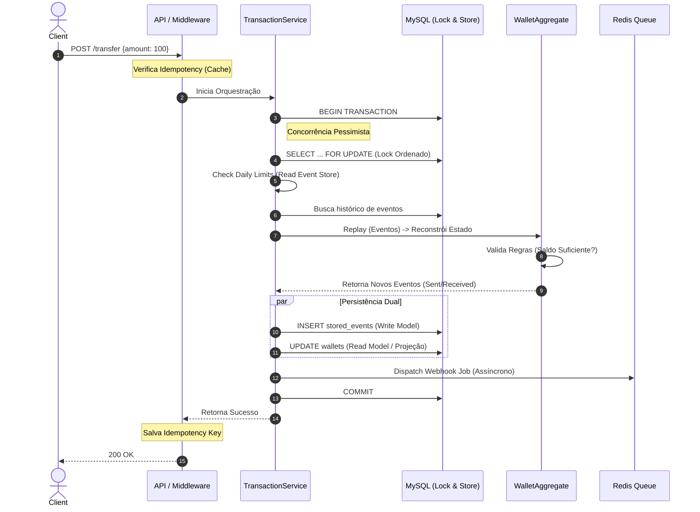

# Wallet API (Staff Engineer Case)


Uma API de Carteira Digital de alta fidelidade, projetada para demonstrar robustez financeira, concorrência segura e padrões de arquitetura escaláveis (**Event Sourcing, CQRS Lite, DDD**).

---

## 🚀 Quick Start

Todo o ambiente é containerizado. Você só precisa de **Docker** e **Make** instalados.

1. **Clone o repositório:**

   ```bash
   git clone https://github.com/jrmarcello/wallet-api-appmax.git
   cd wallet-api-appmax
   ```

2. **Execute o Setup Automático:**
   Este comando sobe os containers, instala dependências, configura Git Hooks, gera chaves, roda migrações e cria o banco de testes.

   ```bash
   make setup
   ```

3. **Acesse a API:**
   * URL Base: `http://localhost:8000/api`
   * Status Check: `curl http://localhost:8000/up`

---

## ⚙️ Configuração

As variáveis de ambiente críticas podem ser ajustadas no arquivo `.env`.

```ini
# Limites Financeiros (Em Centavos)
WALLET_LIMIT_DAILY_DEPOSIT=1000000    # R$ 10.000,00
WALLET_LIMIT_DAILY_WITHDRAWAL=200000  # R$ 2.000,00

# Configuração JWT
JWT_TTL=60 # Minutos
```

---

## 🛠️ Comandos Úteis (Makefile)

Interação com o Docker simplificada através do `make`. Não é precisar decorar aqueles comandos longos. (A não ser que você seja um nerd devops)

| Comando | Descrição |
| :--- | :--- |
| `make help` | Lista todos os comandos disponíveis. |
| `make setup` | **Primeiro uso.** Instala tudo do zero e configura o ambiente. |
| `make test` | Roda a suíte completa de testes (Unit + Feature). |
| `make clean` | Derruba tudo e **apaga volumes** (hard reset). |

---

## ⚓️ Git Hooks & Qualidade

Este projeto utiliza **CaptainHook** para garantir a qualidade do código antes mesmo do Code Review ("Shift Left").

* **Commit Msg:** Valida se a mensagem segue o padrão *Conventional Commits* (ex: `feat: add login`).
* **Pre-Commit:** Executa automaticamente `make lint-check` e `make analyse`. O commit é bloqueado se houver erros de estilo ou tipagem.
* **Pre-Push:** Executa toda a suíte de testes (`make test`).

> *Os hooks são instalados automaticamente ao rodar `make setup`.*

---

## 🧪 Testes Automatizados

O projeto possui cobertura rigorosa utilizando **Pest PHP**.

1. **Unitários:** Validam a matemática do Agregado (Domain) isoladamente.
2. **Feature (E2E):** Validam o fluxo completo (Cadastro -> Depósito -> Transferência) e regras de negócio.
3. **Análise Estática:** **PHPStan Nível 5** + Larastan para garantir tipagem forte.
4. **Stress Test:** Um script Bash (`tests/race_test.sh`) que dispara requisições paralelas via cURL para validar o sistema de Locks contra Race Conditions.

Para rodar toda a suíte de qualidade:

```bash
make check
```

---

## ⚙️ CI/CD (GitHub Actions)

O projeto conta com uma pipeline configurada em `.github/workflows/ci-cd.yml` que executa automaticamente em PRs para a `main`:

1. **Build & Setup:** Sobe serviços (MySQL/Redis) em ambiente isolado.
2. **Quality Gate:** Roda `Pint` (Lint) e `PHPStan` (Análise Estática).
3. **Testing:** Executa a suíte `Pest` com banco de testes dedicado.
4. **Delivery:** Se tudo passar, constrói a imagem Docker (Multi-Arch AMD64/ARM64) e publica no **GitHub Container Registry**.

---

## 🔌 API Endpoints & Insomnia

Na raiz do projeto, encontra-se o arquivo **`insomnia_wallet_api.json`**.

### Como usar no Insomnia

1. Vá em **Dashboard** -> **Create** -> **Import from File**.
2. Selecione o arquivo JSON na raiz deste projeto.
3. No canto superior direito, selecione o ambiente **"Local Development"**.
4. Ao fazer Login (Request 3), copie o token retornado e cole na variável de ambiente `access_token`.

### Resumo de Rotas

#### Auth (JWT)

* `POST /auth/register` - Cria usuário e carteira.
* `POST /auth/login` - Retorna Token.
* `POST /auth/refresh` - Rotaciona token (Blacklist no anterior).
* `POST /auth/webhook` - Configura URL para notificação de recebimento.

#### Wallet

> ⚠️ **Nota:** Operações de escrita exigem header `Idempotency-Key: <uuid>`. A collection do Insomnia gera isso automaticamente.

* `GET  /wallet/balance`
* `GET  /wallet/transactions` (Extrato via Event Replay)
* `POST /wallet/deposit` (Aceita apenas inteiros/centavos)
* `POST /wallet/withdraw`
* `POST /wallet/transfer` (Transação P2P Atômica)

---

## 🧩 Fluxo Lógico Interno

O diagrama abaixo ilustra o ciclo de vida de uma **Transferência**, demonstrando como o sistema prioriza consistência e performance simultaneamente.



---

## 🧠 Decisões de Arquitetura

O projeto foi pensando e construído para resolver problemas reais de sistemas financeiros, indo além de um CRUD tradicional.

### 1. Event Sourcing (Core)

* **Write Model:** Tabela `stored_events`. Fonte da verdade imutável.
* **Read Model:** Tabela `wallets`. Projeção síncrona para leitura rápida de saldo.
* **Por que:** Garante auditabilidade total e permite replay de transações. A lógica matemática reside no Agregado (`WalletAggregate`), isolada do framework (DDD).

### 2. Concorrência & Integridade

* **Pessimistic Locking:** Uso de `lockForUpdate()` com ordenação de IDs no MySQL para prevenir **Race Conditions** e **Deadlocks** em transferências simultâneas.
* **Transações Atômicas:** Tudo (Evento, Projeção, Webhook Dispatch) ocorre dentro de uma transação ACID.

### 3. Resiliência & Idempotência

* **Idempotency Key:** Middleware que intercepta o header `Idempotency-Key`. Requests duplicados (retries de rede) retornam a resposta original cacheada (Redis + DB Audit) sem duplicar a operação financeira.
* **Async Webhooks:** Notificações são enviadas via **Fila (Redis)**, garantindo que a API responda rápido enquanto o processamento pesado ocorre em background com retries automáticos.

### 4. Compliance & Limites Dinâmicos

Implementação de limites diários utilizando a agregação de eventos em tempo real.

* **Limites Separados:** Controle distinto para Entradas (Anti-Money Laundering) e Saídas (Security).
* **Lógica Smart P2P:** Transferências internas entre usuários *não* consomem o limite de Saque (Cash-out), melhorando a experiência do usuário.
* **Zero Coluna Extra:** O volume diário é calculado somando os payloads dos eventos (`FundsDeposited`, `FundsWithdrawn`) do dia corrente diretamente do Event Store.

---

**Autor:** [Marcelo Jr]
