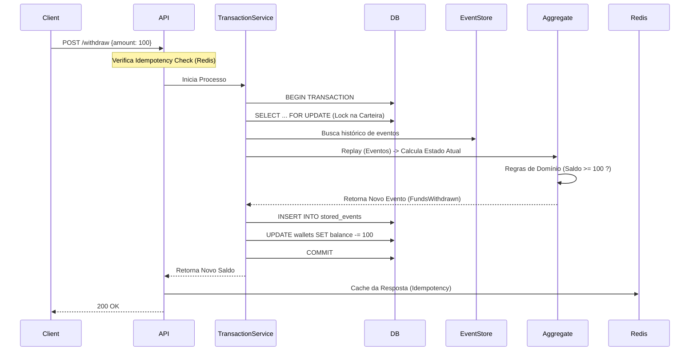

# API de Carteira Digital


API RESTful robusta implementando um ecossistema de Carteira Digital utilizando **Event Sourcing**, **CQRS (Lite)** e princípios de **DDD (Domain-Driven Design)**.

O projeto foi desenhado para resolver desafios reais de sistemas financeiros: concorrência, auditabilidade e integridade atômica de dados.

---

## 🏗 Arquitetura & Decisões Técnicas

A arquitetura foi escolhida para garantir que nenhuma transação seja perdida ou calculada incorretamente.

### 1. Event Sourcing (O Core)

Em vez de apenas sobrescrever uma coluna `saldo` no banco de dados, armazenamos cada mudança de estado como um evento imutável.

* **Write Model (Fonte da Verdade):** A tabela `stored_events` contém o histórico imutável (`FundsDeposited`, `FundsWithdrawn`, `TransferSent`).
* **Aggregate Root:** A classe `WalletAggregate` (Domínio puro) reconstrói o saldo reprocessando os eventos em memória para validar regras de negócio (ex: "Saldo insuficiente") antes de gerar novos eventos.

### 2. Persistência Híbrida (CQRS Lite)

Recalcular o saldo a partir do zero em cada Request (`SELECT`) seria inviável para performance de leitura.

* **Read Model (Projeções):** Mantemos a tabela `wallets` como uma "View Materializada".
* **Consistência Forte:** A atualização do Event Store e da Tabela de Leitura ocorre na mesma Transação de Banco de Dados (`ACID`), garantindo que o endpoint de saldo sempre retorne o dado real imediato (sem atraso de eventual consistency na leitura do próprio usuário).

### 3. Controle de Concorrência & Idempotência

* **Pessimistic Locking:** Utilizamos `SELECT ... FOR UPDATE` na leitura do snapshot da carteira durante operações de escrita. Isso serializa requisições concorrentes (ex: dois saques simultâneos) evitando condições de corrida.
* **Idempotência:** Implementada via header `Idempotency-Key`. Se uma requisição (como Transferência) falhar por timeout na rede mas for processada no server, a retransmissão com a mesma chave devolve a resposta salva anteriormente, sem duplicar o débito.

### 4. Chaves ULID

* Substituímos UUIDv4 e Auto-incremento por **ULIDs**. Eles permitem ordenação lexicográfica baseada no tempo (crucial para ordenação de eventos) e evitam fragmentação de índice no MySQL.

---

## 🛠 Stack Tecnológico

* **Linguagem:** PHP 8.2+
* **Framework:** Laravel 11
* **Banco de Dados:** MySQL 8.0 (Ecolhido no lugar do SQLite para suportar Locks de Concorrência reais)
* **Cache/Fila:** Redis
* **Testes:** Pest PHP
* **Ambiente:** Docker & Docker Compose

---

## 🚀 Como Executar

### Pré-requisitos

* Docker & Docker Compose

### Instalação

1. **Clonar repositório**

    ```bash
    git clone https://github.com/seu-usuario/wallet-api-case.git
    cd wallet-api-case
    ```

2. **Setup do Ambiente**

    ```bash
    cp .env.example .env
    ```

3. **Iniciar Containers**

    ```bash
    docker-compose up -d
    ```

4. **Instalar Dependências e Configurar App**

    ```bash
    # Instalar pacotes PHP
    docker-compose exec app composer install

    # Gerar chave da Aplicação e JWT Secret
    docker-compose exec app php artisan key:generate
    docker-compose exec app php artisan jwt:secret

    # Rodar Migrations
    docker-compose exec app php artisan migrate
    ```

5. **Iniciar Workers (Opcional para Webhooks)**

    ```bash
    docker-compose exec app php artisan queue:work
    ```

---

## 🔗 Endpoints da API

A API responde com padrão envelope JSON: `{ "status": "success", "data": { ... } }`.

### Autenticação (JWT)

* `POST /api/auth/register` - Cria usuário (Carteira é criada automaticamente).
* `POST /api/auth/login` - Retorna `access_token`.
* `POST /api/auth/refresh` - Rotaciona tokens.

### Operações da Carteira
>
> **Nota:** Operações de escrita (`POST`) exigem o header `Idempotency-Key: <uuid>` para prevenir processamento duplicado.

* `GET /api/wallet/balance` - Consulta saldo (via Read Model/Cache).
* `POST /api/wallet/deposit`

    ```json
    { "amount": 1000 } // Representa R$ 10,00 (sempre em centavos)
    ```

* `POST /api/wallet/withdraw`
* `POST /api/wallet/transfer`

    ```json
    {
        "target_email": "amigo@exemplo.com",
        "amount": 5000
    }
    ```

* `GET /api/wallet/transactions` - Extrato (reproduz stream de eventos).

---

## ✅ Testes & Qualidade (QA)

O projeto inclui uma suíte completa de testes focada em garantir a segurança financeira.

```bash
docker-compose exec app ./vendor/bin/pest
```

**Principais Cenários Cobertos:**

* **Race Conditions:** Simulação de múltiplos saques paralelos no mesmo milissegundo. O saldo nunca fica negativo.
* **Matemática de Domínio:** Validação de regras dentro do Agregado.
* **Event Replay:** Verificação se o saldo bate com a soma matemática do histórico.

---

## 🧩 Fluxo Lógico Interno

Resumo simplificado de uma transação:


